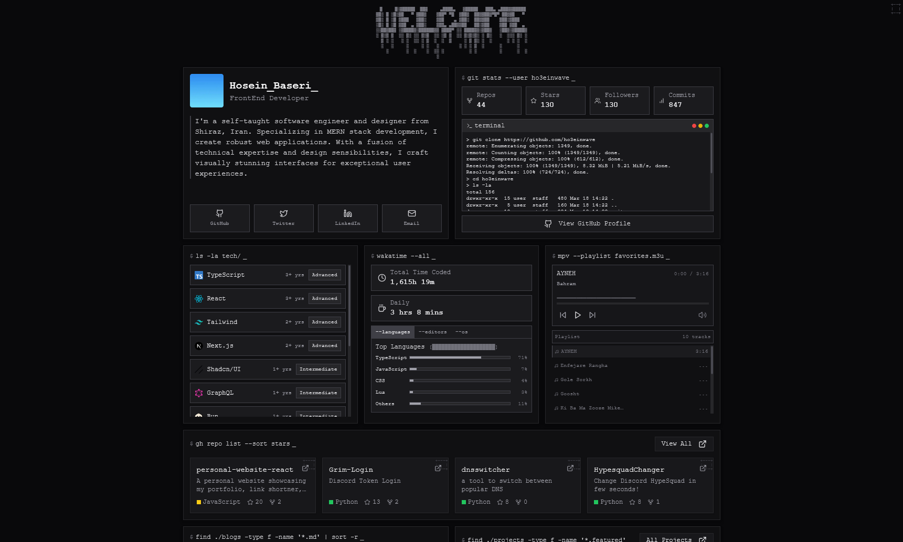

# Personal Portfolio - Terminal Themed

A modern, terminal-themed personal portfolio website built with Next.js, TypeScript, and TailwindCSS. Features a unique bento grid layout with terminal-inspired design elements.



## Features

-   🖥️ Terminal-inspired UI with command prompts and ASCII art
-   📦 Bento grid layout for displaying different information sections
-   🚀 GitHub integration showing repositories and contributions
-   📊 WakaTime statistics for coding activity visualization
-   🎵 Music player component to showcase your favorite tracks
-   📝 Blog posts section with MDX support
-   📱 Fully responsive design for all devices
-   🏗️ Built with modern technologies: Next.js, TypeScript, and TailwindCSS

## Getting Started

### Prerequisites

-   Node.js (v14.0.0 or later)
-   npm or yarn

### Installation

1. Clone the repository

    ```bash
    git clone https://github.com/yourusername/your-portfolio.git
    cd your-portfolio
    ```

2. Install dependencies

    ```bash
    npm install
    # or
    yarn
    ```

3. Start the development server

    ```bash
    npm run dev
    # or
    yarn dev
    ```

4. Open [http://localhost:3000](http://localhost:3000) in your browser

## Customization

### Site Configuration

Edit the `constants/site.ts` file to update your personal information:

```typescript
export const siteConfig = {
    name: "Your Name",
    global_username: "yourusername",
    description: "Your personal website description",
    url: "https://yourwebsite.com",
    author: "Your Name",
    github_username: "yourgithub",
    twitter_username: "yourtwitter",
    linkedin_username: "your-linkedin",
    email: "your.email@example.com",
    // Add other details as needed

    // Personal information
    title: "Your Title/Position",
    bio: "Your biography or description here...",
    avatar: "/avatar.png", // Place your avatar in the public folder
};
```

### Projects

Update the `constants/projects.ts` file to add your own projects:

```typescript
{
    title: "Project Name",
    status: "Active", // or "Completed", "On Hold"
    description: "Description of your project",
    isOpenSource: true, // or false
    image: "https://example.com/image.png", // or local path from public folder
    technologies: [
        "React",
        "TypeScript",
        // Add technologies used
    ],
    link: "https://project-demo.com", // Optional
    repository: "https://github.com/yourusername/project", // Optional
}
```

### Blog Posts

Blog posts are created as MDX files in the `content/` directory. Each post should have frontmatter with metadata:

```markdown
---
title: Post Title
date: 2023-01-01
description: Brief description of the post
---

Your content here in Markdown...
```

### Styling

The project uses TailwindCSS for styling. You can customize the theme in `tailwind.config.js`:

```js
theme: {
  extend: {
    colors: {
      // Customize your color palette
    },
    // Add other theme customizations
  }
}
```

### Components

Most UI components are in the `components/` directory. You can modify or extend them to suit your needs.

## Adding or Removing Sections

The main layout is in `app/page.tsx`. Each section is a Card component in the bento grid. You can:

1. Add new sections by creating a new Card component
2. Remove sections by deleting the respective Card components
3. Rearrange sections by changing their position in the grid

## Deployment

This project can be deployed to various platforms:

### Vercel (Recommended)

```bash
npm install -g vercel
vercel
```

### Netlify

Create a `netlify.toml` file in the root directory:

```toml
[build]
  command = "npm run build"
  publish = ".next"
```

## Contributing

Contributions are welcome! Please feel free to submit a Pull Request.

## License

This project is licensed under the MIT License - see the LICENSE file for details.

## Acknowledgements

-   [Next.js](https://nextjs.org/)
-   [TailwindCSS](https://tailwindcss.com/)
-   [Lucide Icons](https://lucide.dev/)
-   [shadcn/ui](https://ui.shadcn.com/)

---

Made with ❤️ by Hosein
